# ClassBank MVP

A local-first, offline, UWorld-inspired practice platform for university courses — built for macOS as a single-user desktop application.

**Core study loop: create content → build session → answer/reveal → review explanation → track review state**

---

## Screenshots

### Practice Setup
Configure your session with cascading course/unit/topic filters, question type toggles, difficulty, bookmark/flag filters, and shuffle options.

| Initial state | Ready to start |
|---|---|
| 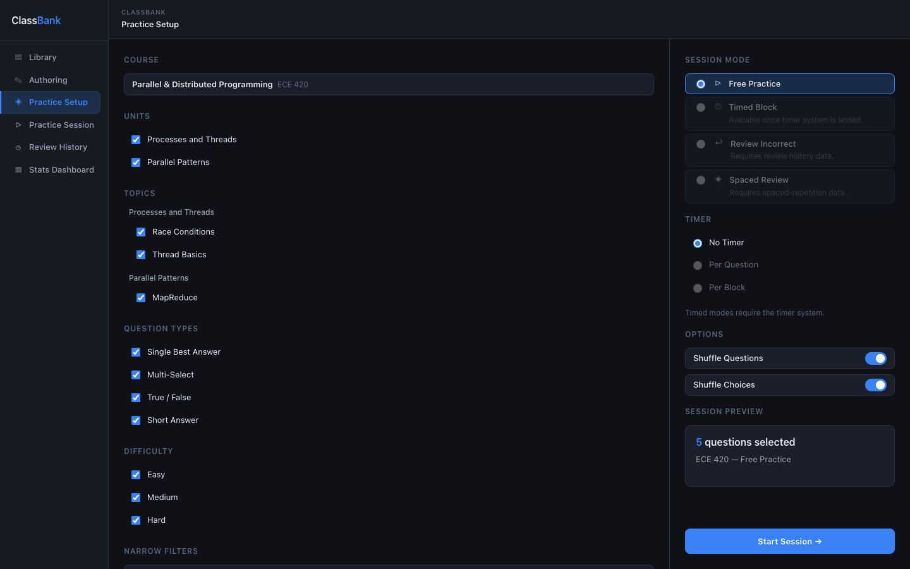 | 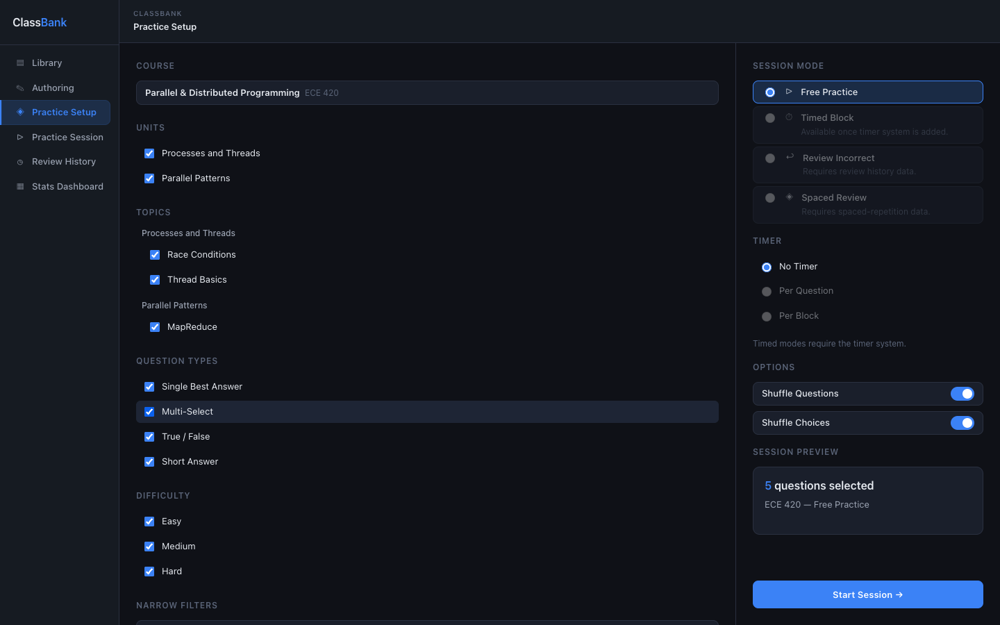 |

### Practice Setup — Mode controls
Session mode radios now include Free Practice, Timed Block, Review Incorrect, and Spaced Review with DB-aware helper text.

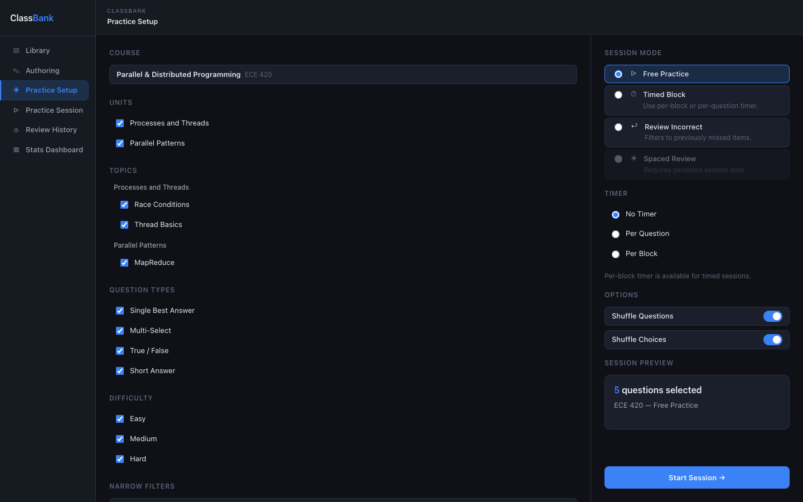

### Practice Session — Question types

| Single best answer (unanswered) | Revealed — correct |
|---|---|
| 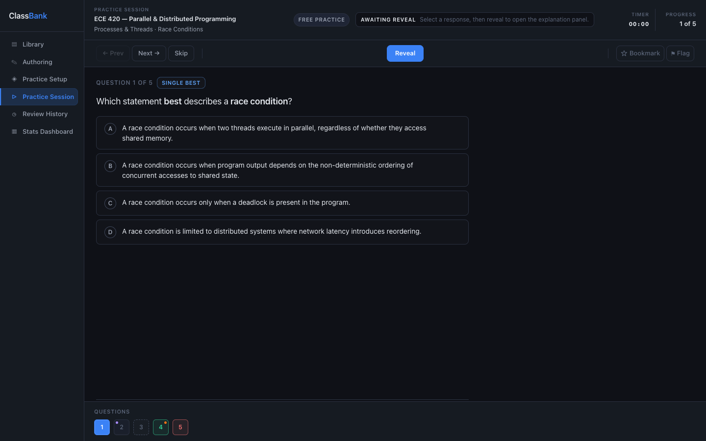 | 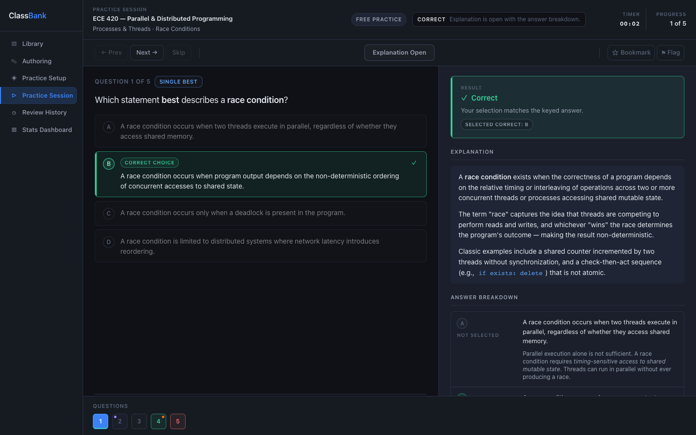 |

| Multi-select with per-choice explanations | Short answer revealed with rating |
|---|---|
| 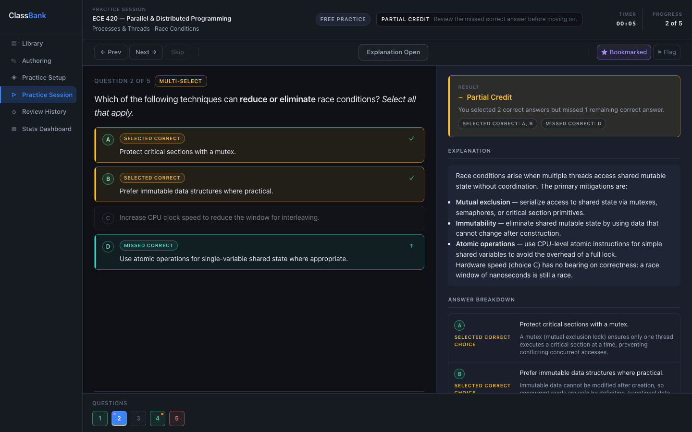 | 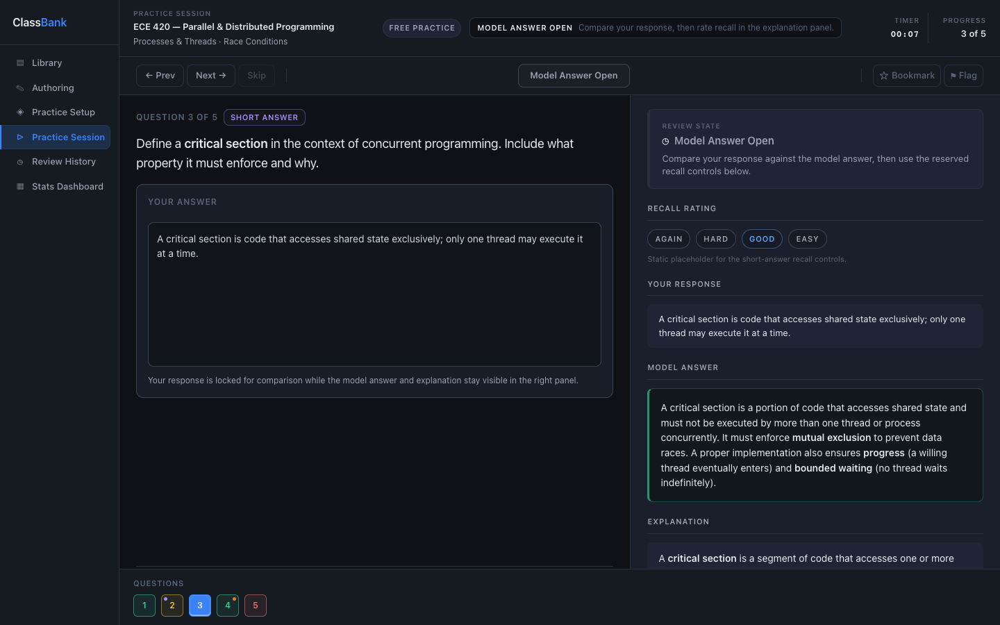 |

### Per-choice explanation breakdown


### Spaced Review flow (flashcards + summary)

| Flashcard front | Flashcard back revealed |
|---|---|
| 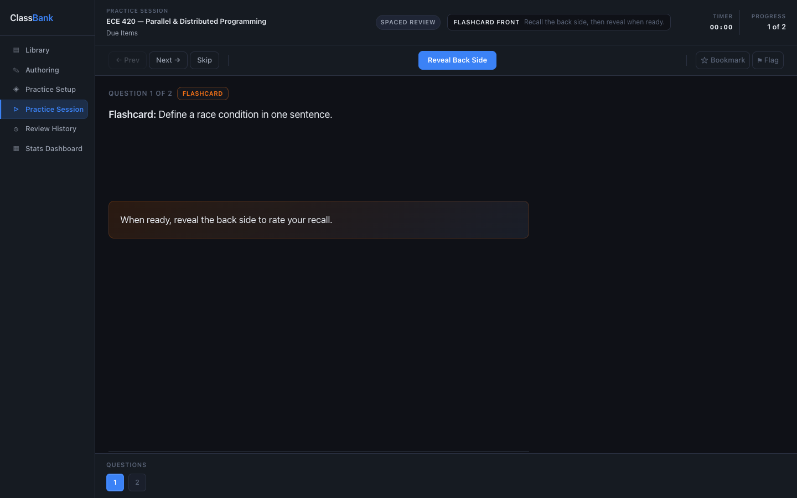 | 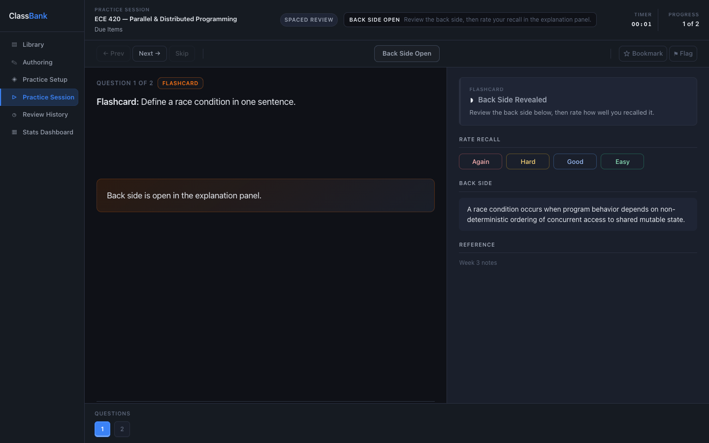 |

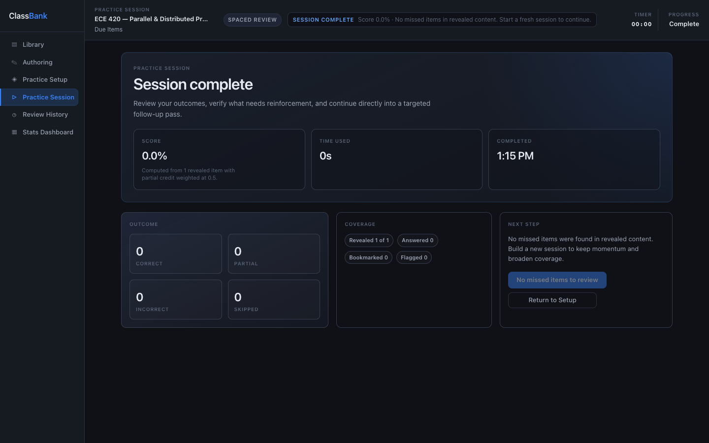

### Question navigator
All navigator states — unanswered, correct, incorrect, skipped, bookmarked, flagged, current.

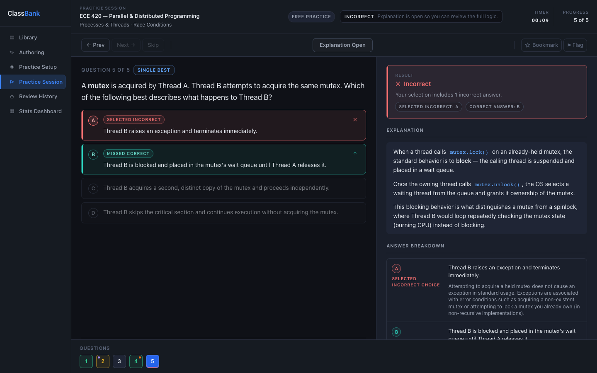

---

## What's built

| Screen | Status | Notes |
|---|---|---|
| Practice Setup | ✅ Working prototype | Full filter/mode UI, spaced-review mode, adaptive-weak filter rules, writes to `sessionStorage` |
| Practice Session | ✅ Working prototype | MCQ + short-answer + flashcard support, reveal/rating loop, session summary, missed-item handoff |
| Library | ✅ Working prototype | Hierarchy CRUD, list/preview, search/filter, item actions |
| Authoring | ✅ Working prototype | Question/flashcard create-edit-duplicate-delete with rich editor |
| Review History | ✅ Working prototype | Session list/detail plus adaptive weak-item review signals |
| Stats Dashboard | ✅ Working prototype | Streak-first summary cards plus adaptive weak MCQ signal metric |

**Persistence:** SQLite is wired through Electron IPC and used by Library/Authoring/Session flows.

## Backup and restore

- Open Library and use the Data Safety section in the left pane.
- Click Create Backup to write a local SQLite backup in the app backup directory.
- To restore, pick a backup file and confirm by typing RESTORE in the confirmation dialog.
- Restore is fail-safe: source backup validation runs before overwrite, and restore executes in a single DB transaction.
- After restore completes, use the reload action shown in status text to refresh in-memory screen state.

---

## Release Notes (March 2026)

This release completes the adaptive review loop across setup, session, persistence, and reporting surfaces.

### Highlights

- Adaptive MCQ review engine now tracks per-question weakness and powers ranked weak-item retrieval.
- Spaced Review mode now runs end-to-end in setup and session, including flashcard front/back recall flow.
- Session completion now shows a full summary with one-click handoff into Review Incorrect.

### Included updates

- Setup behavior now enforces deterministic filter rules (`incorrectOnly`, `adaptiveWeakOnly`, `unseenOnly`).
- Review History and Stats Dashboard now expose adaptive weak-question indicators.
- Test coverage expanded with dedicated suites for session completion, setup contract behavior, and setup filter rules.

---

## Verification

Run the full core verification suite:

```bash
npm run verify:core
```

Individual commands:

```bash
npm test
npm run smoke:electron-db
npm run smoke:authoring-rich
```

---

## Architecture

```
┌─────────────────────────────────────────────────────┐
│  Electron main process                              │
│  ├── main.js          BrowserWindow + app lifecycle │
│  ├── preload.js       contextBridge → window.api    │
│  └── db/              better-sqlite3 IPC handlers   │
│       └── schema.sql  (complete, not yet wired)     │
└────────────────────┬────────────────────────────────┘
                     │ IPC (window.api)
┌────────────────────▼────────────────────────────────┐
│  Renderer (HTML/CSS/JS — no framework)              │
│  ├── practice-setup/index.html                      │
│  │    └── setup.js + course-data.js (fixture)       │
│  └── practice-session/index.html                    │
│       ├── session.js (orchestrator)                 │
│       ├── seed.js (reads sessionStorage or fixture) │
│       ├── session-state.js (in-memory)              │
│       └── components/                              │
│            navigator.js · question-panel.js        │
│            explanation-panel.js · session-toolbar.js│
└─────────────────────────────────────────────────────┘
```

**CSS stack:** `tokens.css` → `reset.css` → `layout.css` → `components.css`

---

## Supported practice item types

| Type | Selection | Strikeout | Reveal | Rating |
|---|---|---|---|---|
| Single best answer MCQ | Single choice | ✅ right-click / Option+click | ✅ | — |
| Multi-select MCQ | Multiple choices | ✅ | ✅ | — |
| True / False | Binary | — | ✅ | — |
| Short answer | Text input | — | ✅ | Again / Hard / Good / Easy |
| Flashcard | Recall from front side | — | Reveal back side | Again / Hard / Good / Easy |

---

## Practice modes (specced, setup UI complete)

- **Free Practice** — work through questions at your own pace
- **Timed Block** — fixed duration, timer counts down
- **Review Incorrect** — only questions you've previously answered wrong
- **Spaced Repetition Review** — due flashcards and short-answer questions

---

## Hard constraints

This is a **local macOS MVP only**. The following are permanent out-of-scope items:

- No web deployment
- No accounts or login
- No cloud sync
- No multi-user features
- No AI question generation
- No moderation or community systems

---

## Content structure

```
Course
└── Unit
    └── Topic
        ├── Questions  (single_best · multi_select · true_false · short_answer)
        └── Flashcards
```

---

## What's next

See the open GitHub issues for the full implementation roadmap:

1. **Electron app shell** — `main.js`, `preload.js`, contextBridge, persistent nav
2. **SQLite persistence layer** — wire `better-sqlite3`, initialize schema, expose `window.api` IPC
3. **Session persistence** — write results, bookmarks, flags, review state to DB
4. **Library screen** — three-pane content browser
5. **Authoring screen** — full rich-text question and flashcard editor
6. **Review History + Stats Dashboard** — implemented; refine acceptance coverage and UI polish

---

## Docs

| Doc | Purpose |
|---|---|
| [`mvp-scope.md`](mvp-scope.md) | Full feature scope and constraints |
| [`backlog.md`](backlog.md) | Phased implementation plan |
| [`schema.sql`](schema.sql) | Complete SQLite schema |
| [`data-model.md`](data-model.md) | Data model reference |
| [`review-system.md`](review-system.md) | Review and spaced repetition rules |
| [`docs/screens/`](docs/screens/) | Per-screen UI specifications |
| [`docs/component-rules.md`](docs/component-rules.md) | Component patterns |
| [`docs/design-tokens.md`](docs/design-tokens.md) | Design tokens reference |